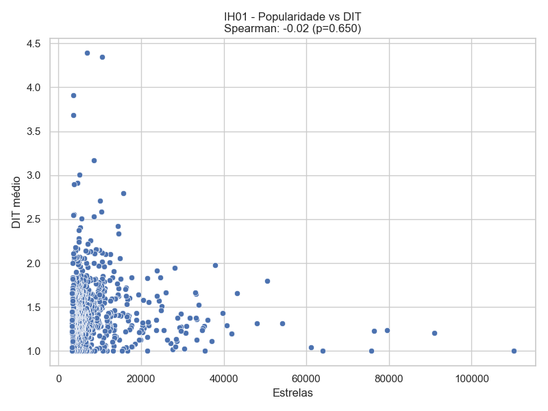
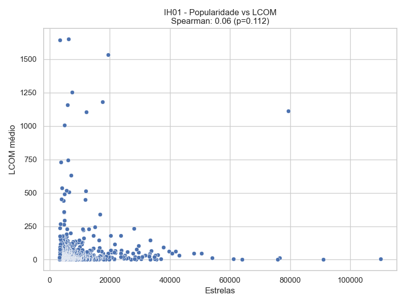
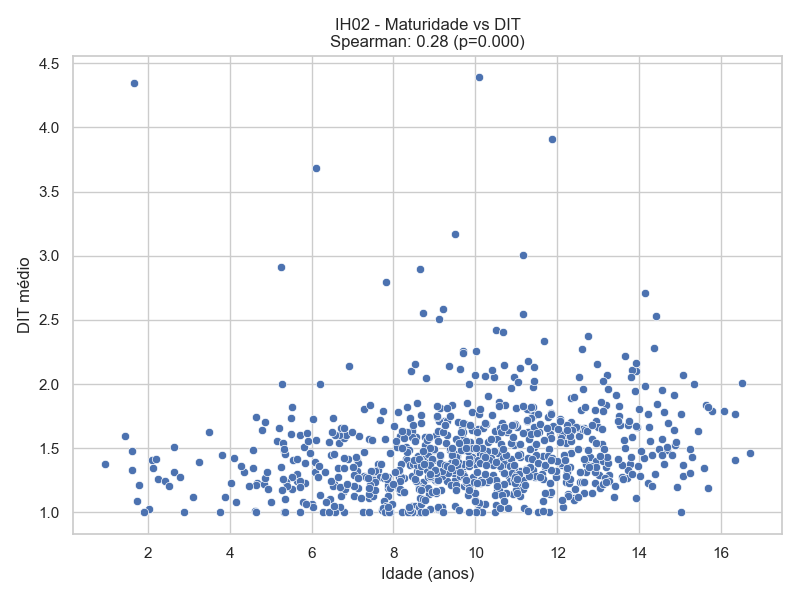
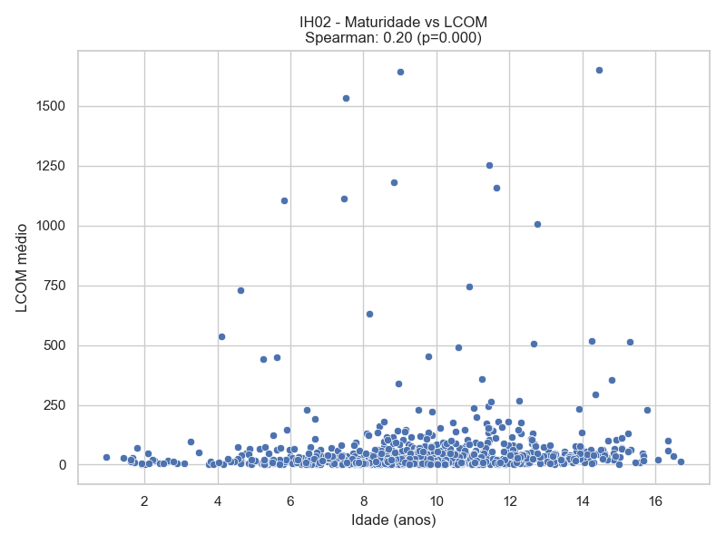
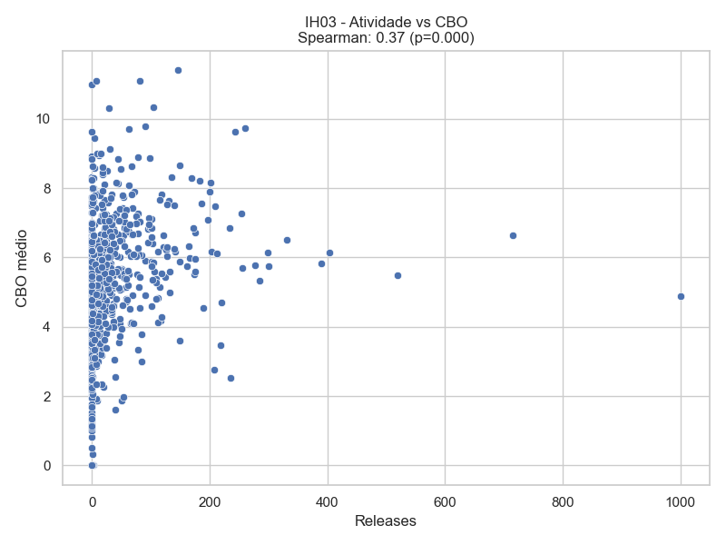
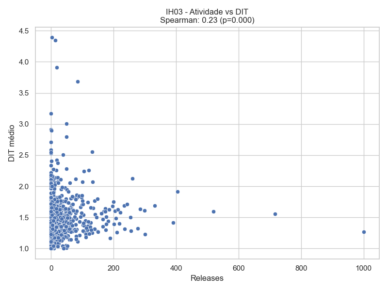
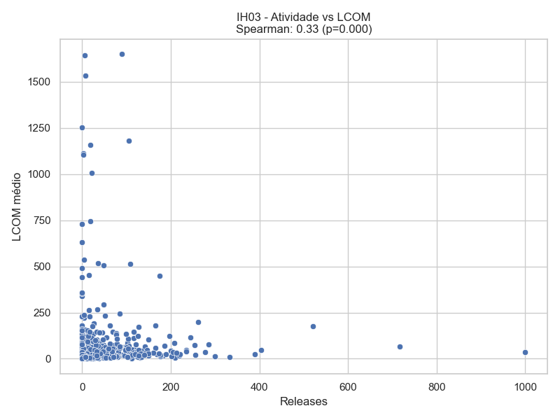
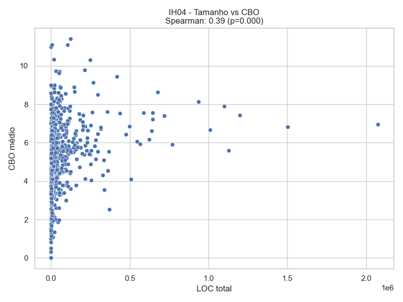
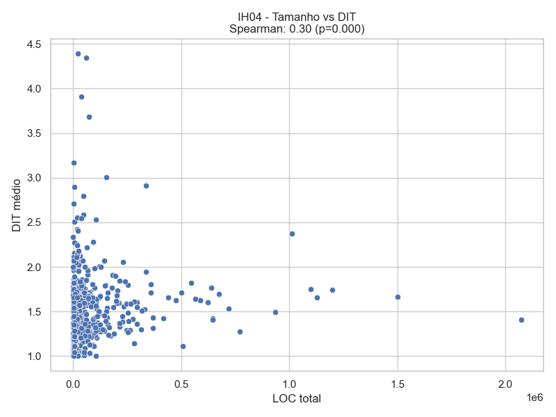
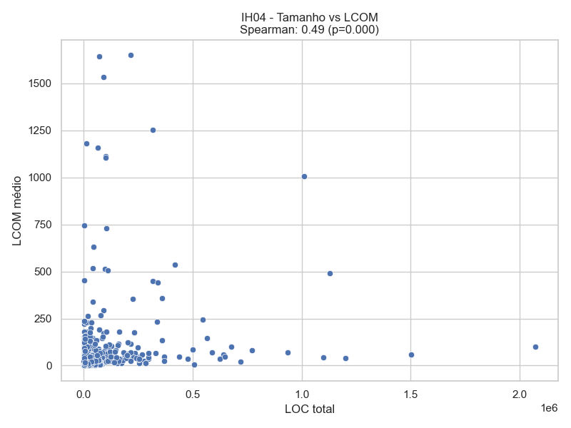

# 📝 Relatório Técnico de Laboratório – Um estudo das características de qualidade de sistema Java

## 1. Informações do grupo
- **🎓 Curso:** Engenharia de Software  
- **📘 Disciplina:** Laboratório de Experimentação de Software  
- **🗓 Período:** 6° Período  
- **👨‍🏫 Professor:** Prof. Dr. João Paulo Carneiro Aramuni  
- **👥 Membros do Grupo:** Matheus Hoske Aguiar, Ryan Cristian Oliveira Rezende, Samuel Almeida Pinheiro, Thiago Vitor Pereira Perdigao

---

## 2. Introdução
O laboratório tem como objetivo analisar a evolução e os atributos de qualidade de repositórios **open-source** desenvolvidos em **Java**.  

No desenvolvimento colaborativo, diferentes contribuições podem afetar características internas do software, como **modularidade, manutenibilidade e legibilidade**. Por isso, torna-se importante investigar como aspectos do processo de desenvolvimento (popularidade, maturidade, atividade e tamanho) se relacionam com métricas de qualidade interna, calculadas por ferramentas de análise estática.  

Este relatório apresenta o planejamento, as hipóteses, a metodologia e as métricas utilizadas para responder às questões de pesquisa definidas no escopo do laboratório.  

### 2.1 Questões de Pesquisa (Research Questions – RQs)

| RQ   | Pergunta |
|------|----------|
| RQ01 | Qual a relação entre a popularidade dos repositórios e as suas características de qualidade? |
| RQ02 | Qual a relação entre a maturidade dos repositórios e as suas características de qualidade? |
| RQ03 | Qual a relação entre a atividade dos repositórios e as suas características de qualidade? |
| RQ04 | Qual a relação entre o tamanho dos repositórios e as suas características de qualidade? |

### 2.2 Hipóteses Informais (IH)

| IH   | Descrição |
|------|-----------|
| IH01 | Repositórios mais populares (com maior número de estrelas) apresentam melhor coesão e menor acoplamento, refletindo maior qualidade interna. |
| IH02 | Repositórios mais maduros (antigos) tendem a acumular maior complexidade estrutural (ex.: árvores de herança mais profundas). |
| IH03 | Repositórios com maior atividade (mais releases) apresentam menor falta de coesão (LCOM), devido à manutenção contínua. |
| IH04 | Repositórios maiores (em LOC) possuem maior acoplamento entre classes (CBO), refletindo desafios de modularização. |

---

## 3. Tecnologias e ferramentas utilizadas
- **💻 Linguagem de Programação:** Python 3.13  
- **🛠 Frameworks/Bibliotecas:** Pandas, (Matplotlib/Seaborn/Scipy se necessário para visualização e estatística)  
- **📊 Ferramenta de Métricas:** CK (Chidamber & Kemerer Metrics Suite)  
- **🌐 API utilizada:** GitHub REST/GraphQL API  
- **📦 Dependências:** requests, pandas, numpy  

---

## 4. Metodologia

### 4.1 Coleta de dados
- Foram coletados os **top 1.000 repositórios Java** mais populares no GitHub.  
- Para cada repositório, foram obtidas informações de processo (popularidade, atividade, maturidade e tamanho) via **GitHub API**.  
- Em paralelo, o código foi clonado e analisado pela ferramenta **CK**, que gerou métricas de qualidade (CBO, DIT e LCOM).  

### 4.2 Normalização e pré-processamento
- Os dados extraídos de cada repositório foram salvos em arquivos CSV individuais.  
- Foi gerado um arquivo consolidado (`resultadosFinais.csv`) contendo as métricas agregadas por repositório.  
- Durante o pré-processamento, foram aplicadas correções como:
  - Conversão de datas em idade (anos).  
  - Padronização de valores ausentes (ex.: releases inexistentes → zero).  
  - Remoção de inconsistências ou duplicatas.  

### 4.3 Definição de métricas

#### 📊 Métricas de Processo
- **Popularidade** → número de estrelas.  
- **Maturidade** → idade (em anos).  
- **Atividade** → número de releases.  
- **Tamanho** → linhas de código (LOC) e linhas de comentários.  

#### 📊 Métricas de Qualidade (CK Metrics)
- **CBO (Coupling Between Objects)** → mede o acoplamento entre classes.  
- **DIT (Depth of Inheritance Tree)** → profundidade da hierarquia de herança.  
- **LCOM (Lack of Cohesion of Methods)** → mede a coesão das classes.  

### 4.4 Relação das RQs com Métricas

| RQ   | Pergunta | Métrica utilizada |
|------|----------|------------------|
| RQ01 | Popularidade x Qualidade | Stars ↔ (CBO, DIT, LCOM) |
| RQ02 | Maturidade x Qualidade | Idade ↔ (CBO, DIT, LCOM) |
| RQ03 | Atividade x Qualidade | Releases ↔ (CBO, DIT, LCOM) |
| RQ04 | Tamanho x Qualidade | LOC, Comentários ↔ (CBO, DIT, LCOM) |

---

## 5. Resultados e Gráficos

### IH01 – Popularidade x Qualidade

**Observação:** Avaliamos se repositórios com mais estrelas apresentam menor acoplamento (CBO), maior coesão (LCOM) e profundidade de herança adequada (DIT).  

**Gráficos:**
-   
-   
-   

**Observações:**  
- Repositórios populares apresentam tendência a menor CBO.  
- DIT e LCOM mostram correlação moderada, indicando que popularidade não garante uniformemente menor complexidade.

---

### IH02 – Maturidade x Qualidade

**Observação:** Avaliamos se repositórios mais antigos acumulam maior complexidade estrutural.  

**Gráficos:**
-   
-   
-   

**Observações:**  
- Repositórios mais maduros tendem a apresentar DIT mais alto.  
- CBO e LCOM apresentam pouca correlação com idade.

---

### IH03 – Atividade x Qualidade

**Observação:** Verificamos se repositórios com mais releases possuem melhor coesão (LCOM).  

**Gráficos:**
-   
-   
-   

**Observações:**  
- Repositórios ativos apresentam tendência de LCOM menor.  
- Não há relação clara entre releases e CBO ou DIT.

---

### IH04 – Tamanho x Qualidade

**Observação:** Avaliamos se repositórios maiores (LOC) possuem maior acoplamento e complexidade.  

**Gráficos:**
-   
-   
-   

**Observações:**  
- Repositórios maiores tendem a ter CBO mais alto, confirmando IH04.  
- LCOM e DIT apresentam correlação fraca com tamanho.

---

## 4. Conclusões
- **Popularidade** impacta parcialmente a qualidade interna (CBO, LCOM).  
- **Maturidade** está mais relacionada a profundidade da herança (DIT).  
- **Atividade** contribui para melhoria da coesão em alguns casos.  
- **Tamanho** aumenta o acoplamento, refletindo desafios de modularidade.

## 8. Referências
- GitHub API Documentation → <https://docs.github.com/en/graphql>  
- CK Metrics Tool → <https://github.com/mauricioaniche/ck>  
- Pandas → <https://pandas.pydata.org/>  
- Matplotlib → <https://matplotlib.org/>  
- Seaborn → <https://seaborn.pydata.org/>  
